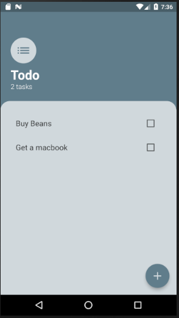
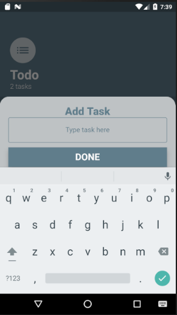
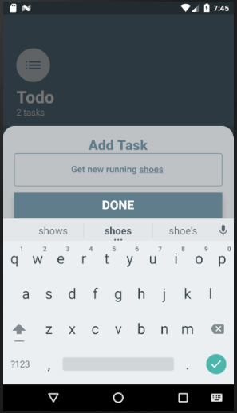
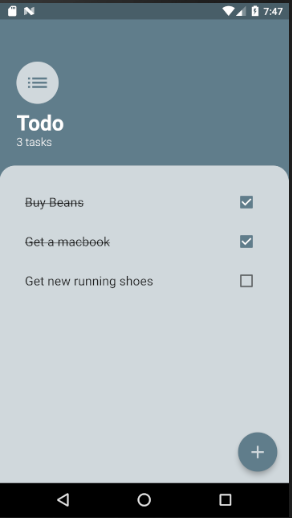
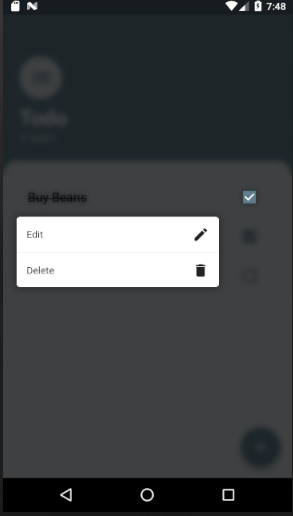
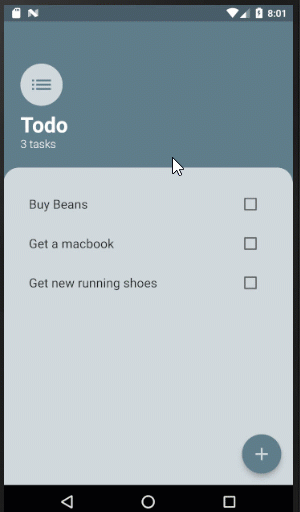

# todo_app

This is a ToDo app built with a combination of various concepts in flutter. The app uses Provider as it's state management architecture.

## What the app teaches:

- State management
- Use of Provider state management pattern
- abstraction
- Use of callbacks
- RxDart
- FocusedMenu which pops up a list of options on long press
- Listview builder

**Screenshots**

